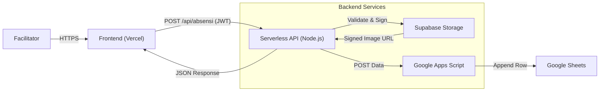

# Presensi Katekumen Digital (v1.4.2)

A modern, responsive, and secure digital attendance system designed for the Catechumenate program at St. Peter's Cathedral, Bandung. This application streamlines the attendance process using QR codes, real-time data synchronization with Google Sheets, and secure image retrieval from Supabase.

---

## 🌟 Key Features

- **📱 Modern Mobile-First UI**: "Liquid glass" aesthetic with a fully responsive design optimized for all devices.
- **⚡ Fast QR Code Scanning**: Integrated `html5-qrcode` library for rapid and accurate attendance taking via device camera.
- **🔐 Secure Facilitator Login**: Shared secret authentication mechanism with JWT (JSON Web Token) session management.
- **📊 Real-time Data Sync**: Attendance records are instantly pushed to Google Sheets via a secure proxy.
- **🖼️ Dynamic Profile Images**: Automatically fetches and displays student profile photos from Supabase Storage using signed URLs.
- **📅 Dynamic Topic Selection**: Facilitators can select weekly topics fetched dynamically from the backend.
- **✅ Instant Feedback**: Visual and haptic-like feedback for successful scans, duplicates, or errors.

---

## 🛠️ Architecture & Tech Stack

The system employs a serverless architecture to bridge a static frontend with powerful cloud services.

### **Frontend**

- **Core**: Pure HTML5, CSS3, JavaScript (ES6+). No heavy frameworks.
- **Libraries**: `html5-qrcode` (Scanning), Google Fonts & Material Icons.
- **Hosting**: Vercel (recommended).

### **Backend (Serverless API)**

- **Runtime**: Node.js (Vercel Serverless Functions).
- **Function**: Acts as a secure proxy and logic layer.
  - **Authentication**: Verifies shared secrets and issues JWTs.
  - **Routing**: Routes requests to the correct Google Apps Script endpoint based on class codes.
  - **Enrichment**: Injects signed image URLs from Supabase into the response.

### **Data & Storage**

- **Database**: Google Sheets (via Google Apps Script Web App).
- **Object Storage**: Supabase Storage (for student profile photos).



---

## 🚀 Installation & Setup

### Prerequisites

- **Google Account** (for Sheets & Apps Script).
- **Supabase Account** (for image storage).
- **Vercel Account** (for hosting and serverless functions).
- **Node.js & NPM** (for local development).

### 1. Google Sheets & Apps Script Setup

1.  Create a Google Sheet with columns: `Timestamp`, `StudentID`, `Name`, `Week`, `ClassCode`, etc.
2.  Open **Extensions > Apps Script**.
3.  Deploy a script (based on your logic) as a **Web App**.
    - **Execute as**: `Me`.
    - **Access**: `Anyone` (API needs public access to the script URL).
4.  Copy the **Web App URL**.

### 2. Supabase Setup

1.  Create a new Supabase project.
2.  Create a storage bucket named `pasfoto-sab` (or update the code to match yours).
3.  Upload student photos with filenames matching their IDs (e.g., `2025-SAB-001.png`).
4.  Get your `SUPABASE_URL` and `SUPABASE_KEY` from Project Settings.

### 3. Environment Variables

Configure the following environment variables in your Vercel project or local `.env` file:

```env
AUTH_SECRET=your_shared_login_password
JWT_SECRET=your_random_jwt_secret_string
SUPABASE_URL=https://your-project.supabase.co
SUPABASE_KEY=your_supabase_anon_key
VERCEL_SCRIPT_MAP_JSON={"SAB":"https://script.google.com/macros/s/YOUR_SCRIPT_ID/exec"}
```

_Note: `VERCEL_SCRIPT_MAP_JSON` maps class codes (e.g., "SAB") to their respective Google Apps Script URLs._

### 4. Deploying

**Using Vercel (Recommended):**

1.  Clone this repository.
2.  Import the project into Vercel.
3.  Add the environment variables from Step 3.
4.  Deploy!

**Local Development:**

```bash
npm install
npm start # or `vercel dev` if using Vercel CLI
```

---

## 📝 Usage Guide

1.  **Login**: Enter the shared facilitator password to access the scanner.
2.  **Select Topic**: Tap "Pilih Topik" to choose the current week's subject.
3.  **Scan**: Point the camera at a student's QR code.
    - **Success**: Shows student name, ID, and photo.
    - **Duplicate**: Warns if the student has already attended.
    - **Error**: Alerts on invalid codes or network issues.
4.  **Verify**: Confirm the data has appeared in your Google Sheet.

---

## 🤝 Contributing

We welcome contributions! Please fork the repository and submit a Pull Request.

1.  Fork the Project
2.  Create your Feature Branch (`git checkout -b feature/AmazingFeature`)
3.  Commit your Changes (`git commit -m 'Add some AmazingFeature'`)
4.  Push to the Branch (`git push origin feature/AmazingFeature`)
5.  Open a Pull Request

---

## ⚖️ License

All rights reserved by **Tim Katekumen Dewasa - Paroki St. Petrus Katedral Bandung**.
For usage inquiries, please contact the maintainers.

---

**Developed with ❤️ by Tim TI Katekumen Dewasa**
