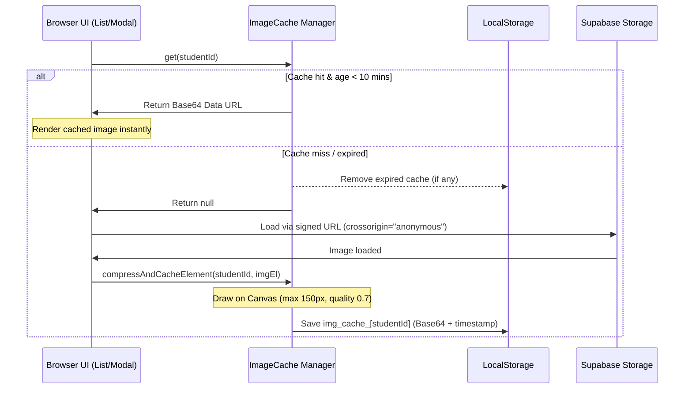

# Spec: Client-side Image Caching & Compression

## Status
Approved

## Date
2026-06-11

## Author
Antigravity Coding Assistant

---

## 1. Objective
To reduce Supabase Storage egress bandwidth usage and DB costs, the web application will fetch profile photos, compress them on-device using Canvas, and store them in `localStorage`. 

## 2. Requirements & Constraints
* **Max Cache Age (TTL)**: 10 minutes (600,000 ms).
* **Storage Limit**: Must respect browser `localStorage` limits (typically 5MB). The target cohort size is under 100 students, so the cache footprint should remain under 1MB.
* **Compression Target**: Downscale to a maximum dimension of 150px (preserving aspect ratio) and convert to `image/jpeg` at `0.7` quality.
* **Fallback Behavior**: If `localStorage` is full, handle the error gracefully by clearing cached images and retrying. If caching fails completely, load from the signed URL directly without crashing.
* **Persistence**: Cache must persist across user logins and sessions.

## 3. Architecture & Key Components

### 3.1 Shared Cache Utility (`public/image-cache.js`)
A clean, modular cache interface:
* `ImageCache.get(studentId)`: returns cached base64 image or `null`.
* `ImageCache.set(studentId, dataUrl)`: saves base64 data URL + current timestamp.
* `ImageCache.compressAndCacheElement(studentId, imgEl)`: resizes and compresses a loaded `` element using a canvas.
* `ImageCache.clearAll()`: purges all keys starting with `img_cache_`.

### 3.2 UI Integration Points
* **`public/profile.js`**:
  * Modifies student list rendering (`renderStudents`) to check `ImageCache.get` before using the network image URL.
  * Adds `crossorigin="anonymous"` and `onload` hooks to compress images fetched from Supabase.
* **`public/script.js`**:
  * Modifies scanning history rows and the student detail modal (`showStudentModal`) similarly.
* **`public/index.html` & `public/profile.html`**:
  * Adds `` before page scripts.

## 4. Eviction & Robustness
* **Quota Management**: In case of `QuotaExceededError`, `ImageCache.set` will catch the error, invoke `clearAll()`, and attempt writing once more.
* **CORS Safety**: Explicitly sets `crossorigin="anonymous"` on `` tags to avoid throwing `SecurityError` when export to canvas is attempted.
